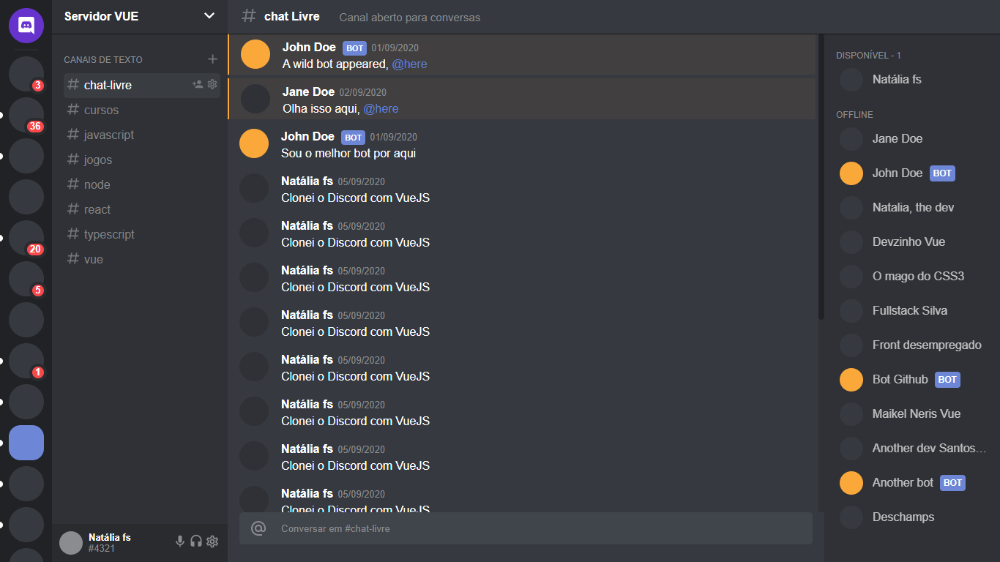

# Clonando a interface do Discord com Vue, HTML e CSS

### Projeto feito com intuito de praticar HTML e CSS usando components feitos em Vue

### O que aprendi/pratiquei:
* CSS Grid
* Sass
* Renderização condicional

## Preview
### Acesse o projeto [aqui](https://vuediscord-nataliafs.netlify.app/)



## Como executar o projeto
* Clone e depois execute os comandos abaixo (com o [Node](https://nodejs.org/en/) já instalado em seu computador)

### Project setup
```
yarn install
```

#### Compiles and hot-reloads for development
```
yarn serve
```

#### Compiles and minifies for production
```
yarn build
```

#### Lints and fixes files
```
yarn lint
```
